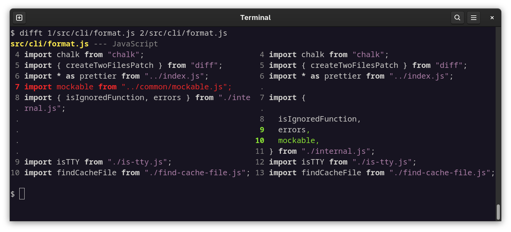

<p align="center">
  <a href="#readme"></a>
  <br>
  <a href="https://difftastic.wilfred.me.uk/introduction.html"></a>
  <a href="https://difftastic.wilfred.me.uk/zh-CN/"></a>
  <a href="https://crates.io/crates/difftastic"></a>
  <a href="https://codecov.io/gh/Wilfred/difftastic"></a>
</p>

Difftastic is a structural diff tool that compares files based on
their syntax.

**For installation instructions, see
[Installation](https://difftastic.wilfred.me.uk/installation.html) in
[the manual](http://difftastic.wilfred.me.uk/).**

## Examples


^ Difftastic understands exactly which pieces of syntax has changed,
and can highlight them in context.


^ Difftastic understands when whitespace matters, and when it's just
an indentation change.



^ Difftastic is not line-oriented. If you reformat your code and it's
now split over multiple lines, difftastic will show you what's
actually changed.


^ Difftastic is compatible with git (see [the configuration
instructions](http://difftastic.wilfred.me.uk/git.html)), as well as
many other version control systems.

## Languages

Difftastic supports over 30 programming languages, see [the
manual](https://difftastic.wilfred.me.uk/languages_supported.html) for the full list.

If a file has an unrecognised extension, difftastic uses a
line-oriented diff with word highlighting.

## Known Issues

Performance. Difftastic scales relatively poorly on files with a large
number of changes, and can use a lot of memory.

Display. Difftastic has a side-by-side display which usually works well, but can
be confusing.

Robustness. Difftastic regularly has releases that fix crashes.

## Non-goals

Patching. Difftastic output is intended for human consumption, and it
does not generate patches that you can apply later. Use `diff` if you
need a patch.

(Patch files are also line-oriented, which is too limited for
difftastic. Difftastic might find additions and removals on the same
line, and it tracks the relationship between line numbers in the old
and new file.)

Merging. AST merging is a hard problem that difftastic does not
address. You might be interested in the [mergiraf
tool](https://mergiraf.org/) ("merge giraffe"), which does do AST
merging.

## FAQ

### Can I use difftastic with git?

You can! The difftastic manual [includes instructions for git
usage](https://difftastic.wilfred.me.uk/git.html). You can also use it
[with mercurial](https://difftastic.wilfred.me.uk/mercurial.html).

If you're an Emacs user, check out [this blog
post](https://tsdh.org/posts/2022-08-01-difftastic-diffing-with-magit.html)
showing one way to use difftastic with magit, as well as
[difftastic.el](https://github.com/pkryger/difftastic.el).

### Does difftastic integrate with my favourite tool?

Probably not. Difftastic is young. Consider writing a plugin for your
favourite tool, and I will link it in the README!

### What about parse errors?

By default, difftastic falls back to a line-oriented diff whenever
parse errors are encountered.

This is a conservative choice to ensure that difftastic never claims
that two syntactically different files are the same.

Parse errors can occur if the file uses language features that the
parser does not understand, if the language relies on a preprocessor
before parsing (e.g. C++), or if the file has genuine syntactic
mistakes.

In practice, difftastic virtually always produces a good result when
there are a few minor parse errors. Consider allowing a small number
of parse errors when using difftastic.

```
$ export DFT_PARSE_ERROR_LIMIT=20
$ difft foo1.c foo2.c
```

### Can difftastic help me with merge conflicts?

Yes! As of version 0.50, difftastic understands merge conflict markers
(i.e. `<<<<<<<`, `=======` and `>>>>>>>`).

Pass your file with conflicts as a single argument to
difftastic. Difftastic will construct the two conflicting files and
diff those.

```
$ difft file_with_conflicts.js
```

### Can difftastic do merges?

No. AST merging is a hard problem that difftastic does not address.

AST diffing is a lossy process from the perspective of a text
diff. Difftastic will ignore whitespace that isn't syntactically
significant, but merging requires tracking whitespace.

The [mergiraf](https://mergiraf.org/) tool does offer merges based on
a tree-sitter AST however.

### Can difftastic ignore reordering?

No. Difftastic always considers order to be important, so diffing
e.g. `set(1, 2)` and `set(2, 1)` will show changes.

If you're diffing JSON, consider sorting the keys before passing them
to difftastic.

```
$ difft <(jq --sort-keys < file_1.json) <(jq --sort-keys < file_2.json)
```

See also [Tricky Cases: Unordered Data
Types](https://difftastic.wilfred.me.uk/tricky_cases.html#unordered-data-types)
in the manual.

### Can I use difftastic to check for syntactic changes without diffing?

Yes. Difftastic can check if the two files have the same AST, without
calculating a diff. This is much faster than normal diffing, and
useful for building tools that check for changes.

For example:

```
$ difft --check-only --exit-code before.js after.js
```

This will set the exit code to 0 if there are no syntactic changes, or
1 if there are changes found.

### Why aren't colours appearing in my terminal?

Difftastic uses ANSI bright colours by default, but some terminal
themes show bright colours as grey. Solarized is a popular theme that
does this.

If you're a Solarized user, use `export DFT_BACKGROUND=light` to
disable bright colours, or try a different terminal colour scheme.

### How does it work?

Difftastic treats structural diffing as a graph problem, and uses
Dijkstra's algorithm.

My [blog
post](https://www.wilfred.me.uk/blog/2022/09/06/difftastic-the-fantastic-diff/)
describes the design, and there is also an [internals section in the
manual](https://difftastic.wilfred.me.uk/diffing.html).

## Translation

+ [Chinese](./translation/zh-CN/README-zh-CN.md)

## License

Difftastic is open source under the MIT license, see LICENSE for more
details.

This repository also includes tree-sitter parsers by other authors in
the `vendored_parsers/` directory. These are a mix of the MIT license and the
Apache license. See `vendored_parsers/*/LICENSE` for more details.

Files in `sample_files/` are also under the MIT license unless stated
otherwise in their headers.
